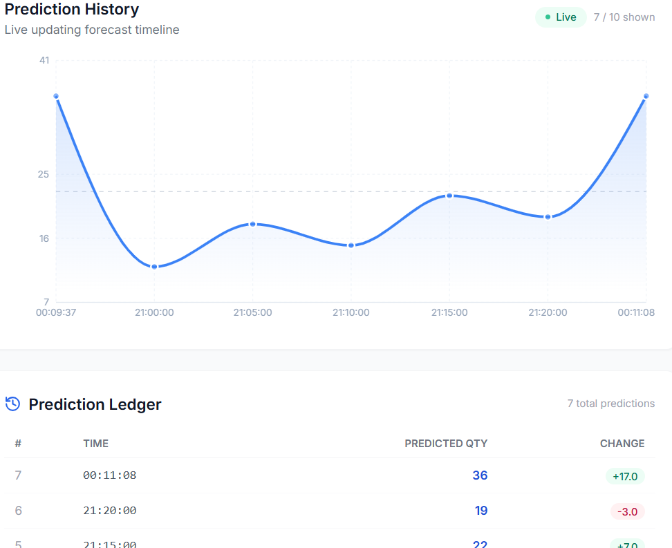

# 📈 Retail Demand Forecasting

A full-stack **Machine Learning web application** that forecasts retail product demand using historical transaction data and customer-product purchasing behavior.

The project combines a **React.js frontend**, **Python backend API**, and **Random Forest Regression model** to provide real-time demand predictions through an interactive business dashboard.

---

## 🚀 Project Overview

Retail businesses need to understand how much demand they can expect for their products in order to make better inventory and sales decisions.

This project uses historical retail transaction data to identify purchasing patterns and generate demand forecasts based on factors such as:

* Product
* Customer
* Unit price
* Country
* Order date
* Order time
* Historical customer-product behavior

The machine learning model processes these features and predicts the expected quantity for a given product and customer scenario.

---

## ✨ Key Features

### 🤖 Machine Learning Demand Forecasting

* Random Forest Regression model
* Customer-product behavioral analysis
* Feature engineering from historical transactions
* Real-time demand prediction
* Model performance evaluation

### 📊 Business Dashboard

The dashboard provides important business KPIs, including:

* Total Revenue
* Total Orders
* Top Product
* Top Country
* Highest Sale
* Model R² Score
* Backend API status
* ML model status
* Frontend application status

### 📈 Forecast Scenarios

The application provides additional demand insights through:

* Weekly demand patterns
* Seasonality
* Price elasticity
* Promotional impact
* Forecast scenarios

### ⚡ Real-Time Prediction

Users can enter:

* Product
* Unit Price
* Customer ID
* Country
* Order Date
* Order Time

and generate a demand forecast without refreshing the application.

### 🎨 Modern User Interface

The application features:

* Responsive React interface
* Modern dashboard design
* Glassmorphism-inspired UI
* Interactive charts
* KPI cards
* Real-time prediction display

---

# 📸 Application Screenshots

## 🏠 Home Page

The landing page provides an overview of the Retail Demand Forecasting application.


---

## 📈 Forecast Page

The forecast page allows users to enter the required customer and product information and generate demand forecasts.


---

## 🤖 Demand Prediction

The prediction result displays the estimated demand generated by the machine learning model.



---

## 📊 Data Prediction Dashboard

The dashboard provides business KPIs and visual insights into retail demand and prediction results.


---

# 🛠️ Technology Stack

## Frontend

| Technology   | Purpose                        |
| ------------ | ------------------------------ |
| React.js     | Frontend application           |
| Tailwind CSS | UI styling                     |
| Recharts     | Interactive charts             |
| Axios        | Frontend-backend communication |
| Lucide React | Icons                          |

## Backend

| Technology      | Purpose                         |
| --------------- | ------------------------------- |
| Python          | Backend development             |
| Flask / FastAPI | REST API                        |
| Pandas          | Data processing                 |
| NumPy           | Numerical operations            |
| Joblib          | Model loading and serialization |

## Machine Learning

| Technology            | Purpose                |
| --------------------- | ---------------------- |
| Scikit-learn          | Machine learning       |
| RandomForestRegressor | Demand prediction      |
| Pandas                | Feature engineering    |
| NumPy                 | Numerical calculations |

---

# 📂 Project Structure

```text
Retail_Forecast/
│
├── Backend/
│   ├── app.py
│   ├── requirements.txt
│   ├── model/
│   └── ...
│
├── Frontend/
│   ├── package.json
│   ├── public/
│   ├── src/
│   └── ...
│
├── screenshots/
│   ├── dashboard.png
│   └── forecast-prediction.png
│
├── .gitignore
├── README.md
└── ...
```

> The exact files and folders may vary depending on the current implementation.

---

# 📊 Dataset

This project uses the **UCI Online Retail Dataset**, which contains more than **500,000 transaction records** from a UK-based online retail business.

The dataset contains information related to:

* Invoice number
* Product code
* Product description
* Quantity
* Invoice date
* Unit price
* Customer ID
* Country

The historical transaction data is cleaned and transformed into features suitable for machine learning.

---

# 🧹 Data Processing

Before training the model, the transaction data goes through several preprocessing steps.

### Data Processing Pipeline

```text
Raw Transaction Data
        ↓
Data Cleaning
        ↓
Missing Value Handling
        ↓
Data Type Conversion
        ↓
Feature Engineering
        ↓
Customer-Product Aggregation
        ↓
Model Training Dataset
```

The objective is to convert raw transaction records into meaningful customer and product behavioral features.

---

# 🧠 Feature Engineering

The model does not rely only on product price and transaction date.

Historical purchasing behavior is also used to create useful features.

Examples include:

* Average quantity purchased
* Total quantity purchased
* Number of previous purchases
* Average unit price
* Customer purchasing frequency
* Product purchasing frequency
* Customer-product purchase history

### Example

Suppose a customer has historically purchased a particular product several times.

The system can calculate:

```text
Customer
    +
Product
    ↓
Historical Purchase Behavior
    ↓
Feature Engineering
    ↓
Random Forest Model
    ↓
Predicted Demand
```

This allows the model to learn relationships between customers, products, and historical demand.

---

# 🤖 Machine Learning Model

The project uses a:

## Random Forest Regressor

Random Forest is an ensemble machine learning algorithm that combines multiple decision trees to produce a robust regression prediction.

The model is trained on engineered customer-product features and historical transaction data.

### Model Workflow

```text
Historical Transactions
          ↓
Feature Engineering
          ↓
Training Dataset
          ↓
Train / Test Split
          ↓
Random Forest Regressor
          ↓
Model Evaluation
          ↓
Saved ML Model
          ↓
Backend API
          ↓
Real-Time Prediction
```

---

# 📊 Model Evaluation

The model is evaluated using regression metrics such as:

* R² Score
* Mean Absolute Error (MAE)
* Mean Squared Error (MSE)
* Root Mean Squared Error (RMSE)

The current dashboard displays an **R² score of approximately 90.47%** for the implemented model.

> The R² score can change depending on preprocessing, feature engineering, training/test split, dataset version, and model parameters. R² should not be interpreted as classification accuracy.

---

# 🔌 Application Architecture

```text
                    ┌───────────────────────┐
                    │      React.js         │
                    │   Frontend Dashboard  │
                    └───────────┬───────────┘
                                │
                                │ Axios
                                ▼
                    ┌───────────────────────┐
                    │      Python API       │
                    │    Flask / FastAPI    │
                    └───────────┬───────────┘
                                │
                                ▼
                    ┌───────────────────────┐
                    │  Feature Engineering  │
                    └───────────┬───────────┘
                                │
                                ▼
                    ┌───────────────────────┐
                    │ Random Forest Model   │
                    │   Demand Regressor    │
                    └───────────┬───────────┘
                                │
                                ▼
                    ┌───────────────────────┐
                    │   Demand Prediction   │
                    └───────────┬───────────┘
                                │
                                ▼
                    ┌───────────────────────┐
                    │ React Dashboard       │
                    │ Charts + KPIs + Result│
                    └───────────────────────┘
```

---

# ⚙️ Getting Started

## 1. Clone the Repository

```bash
git clone https://github.com/akashkum121/Retail_Forecast.git
```

Navigate into the project:

```bash
cd Retail_Forecast
```

---

# 🐍 2. Start the Backend

Open a terminal and navigate to the backend folder:

```powershell
cd Backend
```

Create a Python virtual environment:

```powershell
python -m venv venv
```

Activate the virtual environment:

```powershell
venv\Scripts\activate
```

Install the required Python packages:

```powershell
pip install -r requirements.txt
```

Start the backend:

```powershell
python app.py
```

The backend API runs at:

```text
http://127.0.0.1:5000
```

> The exact backend URL and port depend on the configuration in `Backend/app.py`.

---

# ⚛️ 3. Start the Frontend

Open a **new terminal**.

Navigate to the frontend directory:

```powershell
cd Frontend
```

Install the Node.js dependencies:

```powershell
npm install
```

Start the React application:

```powershell
npm start
```

The frontend application runs at:

```text
http://localhost:3000
```

---

# 🔄 How Prediction Works

A typical prediction request follows this process:

```text
User enters:
Product
Unit Price
Customer ID
Country
Date
Time
       ↓
React Frontend
       ↓
Axios API Request
       ↓
Python Backend
       ↓
Feature Preparation
       ↓
Random Forest Model
       ↓
Predicted Quantity
       ↓
API Response
       ↓
Prediction Card
       ↓
Forecast Charts
```

For example:

```text
Product:       TUMBLER NEW ENGLAND
Unit Price:    £2.63
Customer ID:   17850
Country:       Cyprus

             ↓

Random Forest Model

             ↓

Predicted Demand: 36 units
```

---

# 📊 Business Insights

The application can support several retail analytics use cases.

## Inventory Planning

Demand predictions can help businesses estimate how much inventory may be required.

## Stock Management

Products with higher expected demand can be monitored to reduce potential stockouts.

## Customer Analysis

Historical customer-product behavior can be used to understand purchasing patterns.

## Product Analysis

The dashboard can highlight top-performing products and demand patterns.

## Sales Planning

Historical transaction data and predicted demand can support sales planning and decision-making.

---

# 📈 Forecast Scenarios

The application includes several forecast scenario views.

### Weekly Patterns

Helps identify differences in expected demand across the days of the week.

### Seasonality

Helps analyze recurring demand patterns over time.

### Price Elasticity

Provides a way to explore how changes in price may influence predicted demand.

### Promotional Impact

Allows users to explore potential changes in demand under promotional scenarios.

> Scenario outputs should be interpreted as model-based estimates rather than guaranteed future sales.

---

# 📡 Backend API

The backend provides the communication layer between the React application and machine learning model.

General request flow:

```text
Frontend
   ↓
HTTP Request
   ↓
Backend API
   ↓
Feature Processing
   ↓
ML Model
   ↓
Prediction
   ↓
JSON Response
   ↓
Frontend
```

The exact API endpoints and request parameters are defined in:

```text
Backend/app.py
```

---

# 📌 Project Highlights

### Data Analytics

* Retail transaction analysis
* Customer behavior analysis
* Product performance analysis
* KPI generation
* Demand pattern analysis

### Machine Learning

* Feature engineering
* Random Forest Regression
* Regression model evaluation
* Customer-product behavioral prediction

### Full-Stack Development

* React.js
* Python backend
* REST API
* Axios integration
* Machine learning model integration

### Data Visualization

* KPI cards
* Interactive charts
* Demand forecasting
* Weekly demand patterns
* Forecast scenarios

---

# 🔮 Future Improvements

The project can be extended with:

* [ ] Automated model retraining
* [ ] Time-series forecasting models
* [ ] XGBoost / LightGBM model comparison
* [ ] Database integration
* [ ] User authentication
* [ ] Cloud deployment
* [ ] Docker containerization
* [ ] CI/CD pipeline
* [ ] Model monitoring
* [ ] Inventory recommendation system
* [ ] Stockout prediction
* [ ] Downloadable prediction reports
* [ ] Advanced customer segmentation

---

# 💡 Future ML Enhancements

Future versions could compare the Random Forest model against:

```text
Random Forest
      ↓
XGBoost
      ↓
LightGBM
      ↓
Gradient Boosting
      ↓
Time-Series Models
```

Model performance could then be compared using:

* R²
* MAE
* RMSE
* MAPE

This would help determine which model provides the most reliable demand forecasts.

---

# 🖥️ System Requirements

Recommended environment:

```text
Python 3.x
Node.js
npm
Git
Modern Web Browser
```

The application requires both the backend API and frontend development server to be running during local development.

---

# 📁 Important Files

| File / Folder              | Description                      |
| -------------------------- | -------------------------------- |
| `Backend/app.py`           | Backend API and prediction logic |
| `Backend/requirements.txt` | Python dependencies              |
| `Frontend/`                | React frontend application       |
| `screenshots/`             | README application screenshots   |
| `.gitignore`               | Files excluded from Git          |
| `README.md`                | Project documentation            |

---

# 👨‍💻 Author

## Akash Kumar

GitHub:
https://github.com/akashkum121

Project Repository:
https://github.com/akashkum121/Retail_Forecast

---

# 📄 License

This project is created for **educational, portfolio, and demonstration purposes**.

Please review the licensing terms of the original dataset and third-party dependencies before using the project for commercial purposes.

---

# ⭐ If You Like This Project

If you find this project useful or interesting, consider giving the repository a ⭐ on GitHub.
